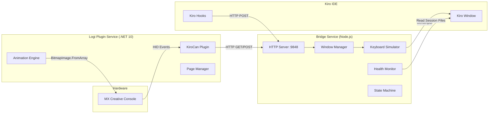
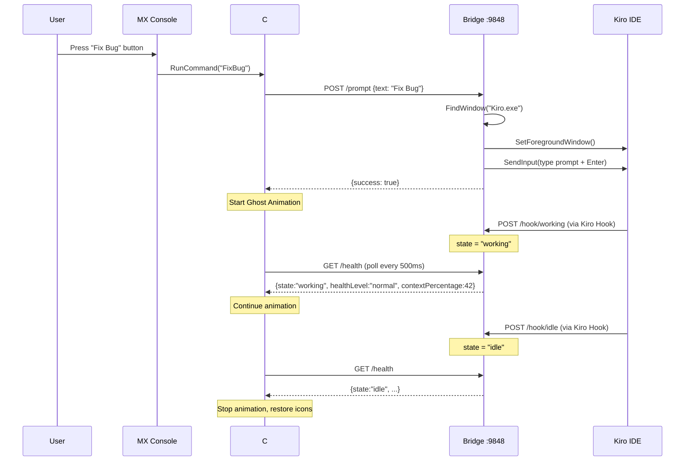
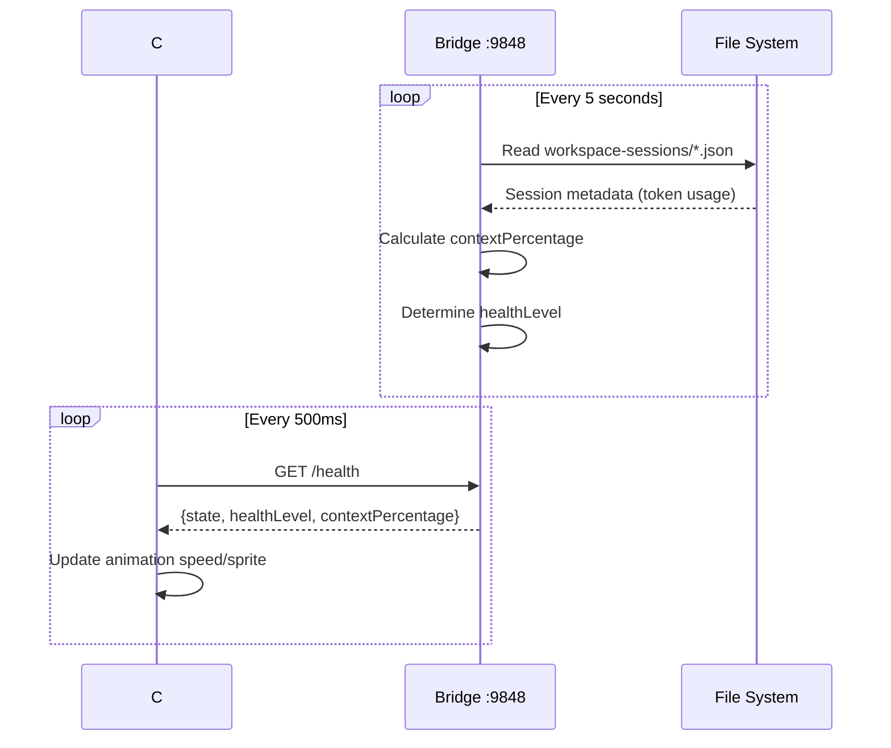
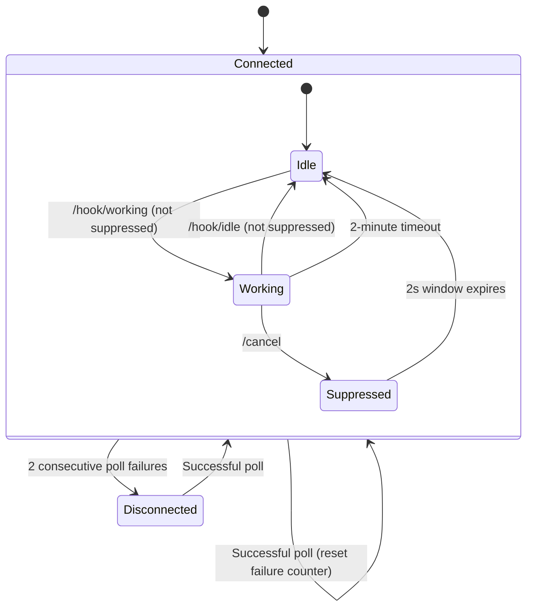

# KiroCan Technical Design Document

## Overview

KiroCan is a physical AI coding companion that connects a Logitech MX Creative Console to Kiro IDE on Windows. The system comprises two cooperating services:

1. **C# Plugin** (.NET 10) — runs inside Logi Plugin Service, handles hardware events (button presses, dial rotation), renders LCD button images (static icons and animated ghost sprite), and communicates with the Bridge via HTTP.
2. **Node.js/TypeScript Bridge** — a local HTTP server on port 9848 that receives commands from the Plugin, executes Win32 window activation and keyboard simulation against Kiro IDE, monitors context health from session files, and receives state-change hooks from Kiro.

The data flow is unidirectional for commands: **MX Creative Console → C# Plugin → HTTP → Bridge → Win32 → Kiro IDE**. State flows back via polling: **Plugin polls Bridge /health** every 500ms to learn current state and context health.

### Key Design Goals

- Sub-500ms response from button press to IDE action
- Reliable window activation even when Kiro is not in foreground
- Smooth 10fps ghost animation across a 3x3 LCD grid (216x216 virtual canvas)
- Graceful degradation when Bridge is unreachable or Kiro is not running
- Zero configuration for end users — plug in device, start services, go

## Architecture

### System Architecture Diagram



### Sequence Diagram: Button Press Flow



### Sequence Diagram: Health Polling



## Components and Interfaces

### C# Plugin Components

#### KiroCanPlugin (inherits `Plugin`)

The top-level plugin class responsible for initialization and lifecycle.

```csharp
namespace Loupedeck.KiroCanPlugin
{
    public class KiroCanPlugin : Plugin
    {
        public override void Load()
        {
            PluginResources.Init(this.Assembly);
        }

        public override void Unload() { }
    }
}
```

#### KiroCanApplication (inherits `ClientApplication`)

Manages application-level concerns: the HTTP polling timer, bridge connectivity state, and shared state accessible to all commands.

```csharp
public class KiroCanApplication : ClientApplication
{
    // Shared state
    public BridgeState CurrentState { get; private set; } = BridgeState.Idle;
    public HealthLevel CurrentHealthLevel { get; private set; } = HealthLevel.Normal;
    public int ContextPercentage { get; private set; } = 0;
    public bool IsBridgeConnected { get; private set; } = true;
    
    // Polling
    private Timer _pollTimer;
    private int _consecutiveFailures = 0;
    private const int MaxConsecutiveFailures = 2;
    private const int PollIntervalMs = 500;
    private static readonly HttpClient _httpClient = new HttpClient 
    { 
        Timeout = TimeSpan.FromMilliseconds(2000) 
    };

    public override void Start()
    {
        _pollTimer = new Timer(PollBridgeHealth, null, 0, PollIntervalMs);
    }

    private async void PollBridgeHealth(object state)
    {
        try
        {
            var response = await _httpClient.GetAsync("http://localhost:9848/health");
            var json = await response.Content.ReadAsStringAsync();
            var health = JsonSerializer.Deserialize<HealthResponse>(json);
            
            CurrentState = Enum.Parse<BridgeState>(health.State, true);
            CurrentHealthLevel = Enum.Parse<HealthLevel>(health.HealthLevel, true);
            ContextPercentage = health.ContextPercentage;
            IsBridgeConnected = true;
            _consecutiveFailures = 0;
            
            OnStateChanged?.Invoke(this, EventArgs.Empty);
        }
        catch
        {
            _consecutiveFailures++;
            if (_consecutiveFailures >= MaxConsecutiveFailures)
            {
                IsBridgeConnected = false;
                OnDisconnected?.Invoke(this, EventArgs.Empty);
            }
        }
    }

    public event EventHandler OnStateChanged;
    public event EventHandler OnDisconnected;
}
```

#### AnimationEngine

Manages the 30-frame ghost animation across the 3x3 LCD grid. Runs on a dedicated timer at 10fps (100ms per frame at normal speed).

```csharp
public class AnimationEngine
{
    private readonly byte[][] _normalFrames;      // 30 frames, 216x216 pixels
    private readonly byte[][] _criticalFrames;    // 30 frames, alternate sprite (flaming hair)
    private int _currentFrame = 0;
    private Timer _frameTimer;
    private HealthLevel _healthLevel = HealthLevel.Normal;

    // Frame durations based on health level
    private static readonly Dictionary<HealthLevel, int> FrameDurations = new()
    {
        { HealthLevel.Normal, 100 },    // 10fps (1x speed)
        { HealthLevel.Worried, 67 },    // 15fps (1.5x speed)
        { HealthLevel.Critical, 50 }    // 20fps (2x speed)
    };

    public void Start(HealthLevel healthLevel)
    {
        _healthLevel = healthLevel;
        _currentFrame = 0;
        var interval = FrameDurations[healthLevel];
        _frameTimer = new Timer(AdvanceFrame, null, 0, interval);
    }

    public void Stop()
    {
        _frameTimer?.Dispose();
        _frameTimer = null;
        _currentFrame = 0;
    }

    public void UpdateHealthLevel(HealthLevel newLevel)
    {
        if (_healthLevel == newLevel || _frameTimer == null) return;
        _healthLevel = newLevel;
        var interval = FrameDurations[newLevel];
        _frameTimer.Change(0, interval);
    }

    private void AdvanceFrame(object state)
    {
        _currentFrame = (_currentFrame + 1) % 30;
        OnFrameChanged?.Invoke(this, _currentFrame);
    }

    /// <summary>
    /// Extracts a 72x72 tile from the current 216x216 frame for a specific grid position.
    /// Position 0-8 maps to row/col in a 3x3 grid.
    /// </summary>
    public BitmapImage GetTile(int position)
    {
        var frames = _healthLevel == HealthLevel.Critical ? _criticalFrames : _normalFrames;
        var frame = frames[_currentFrame];
        
        int row = position / 3;
        int col = position % 3;
        var tileBytes = ExtractTile(frame, row, col, tileSize: 72);
        
        return BitmapImage.FromArray(tileBytes);
    }

    public event EventHandler<int> OnFrameChanged;
}
```

#### Page Manager

Manages the 3-page button layout and determines which commands are shown on each page.

```csharp
public static class PageLayout
{
    // Page 1: Snippets & Controls (positions 0-8)
    public static readonly string[] Page1 = {
        "Screenshot", "BeHonest", "DontCodeYet",
        "ShowOptions", "ExplainWhy", "Stop",
        "KeepShort", "NoTests", "Go"
    };

    // Page 2: Utility Controls
    public static readonly string[] Page2 = {
        "NewSession", "StructPrompt", "InlineChat",
        "TerminalToChat", "ScreenRecord", "AskKiro",
        "UnderstandWorkspace", "StartSpec", "GitCommit"
    };

    // Page 3: Prompt Commands
    public static readonly string[] Page3 = {
        "Criticize", "Refactor", "WriteTests",
        "Explain", "FixBug", "Optimize",
        "Review", "Document", "Simplify"
    };
}
```

#### Dial Adjustment (Session Navigation)

```csharp
public class SessionNavigateAdjustment : PluginDynamicAdjustment
{
    private int _rotationAccumulator = 0;
    private RotationDirection _currentDirection = RotationDirection.Undefined;
    private const int NotchThreshold = 18;

    public SessionNavigateAdjustment()
        : base(displayName: "Navigate Sessions", description: "Rotate to switch Kiro sessions", 
               groupName: "Navigation", hasReset: false)
    { }

    protected override void ApplyAdjustment(String actionParameter, Int32 ticks)
    {
        var newDirection = ticks > 0 ? RotationDirection.Clockwise : RotationDirection.CounterClockwise;
        
        // Reset accumulator on direction reversal
        if (_currentDirection != RotationDirection.Undefined && newDirection != _currentDirection)
        {
            _rotationAccumulator = 0;
        }
        
        _currentDirection = newDirection;
        _rotationAccumulator += Math.Abs(ticks);

        if (_rotationAccumulator >= NotchThreshold)
        {
            _rotationAccumulator = 0;
            var endpoint = newDirection == RotationDirection.Clockwise 
                ? "/session/next" 
                : "/session/previous";
            SendBridgeRequest(endpoint);
        }
    }
}
```

### Bridge Service Components

#### HTTP Server (`http-server.ts`)

Express-based HTTP server exposing all endpoints.

```typescript
interface BridgeState {
  state: "working" | "idle";
  healthLevel: "normal" | "worried" | "critical";
  contextPercentage: number; // 0-100
}

interface EndpointMap {
  "GET /health": () => BridgeState;
  "POST /cancel": () => { success: boolean };
  "POST /ask": (body: { text: string }) => { success: boolean };
  "POST /prompt": (body: { text: string }) => { success: boolean };
  "POST /inline": () => { success: boolean };
  "POST /terminal": () => { success: boolean };
  "POST /new-session": () => { success: boolean };
  "POST /session/next": () => { success: boolean };
  "POST /session/previous": () => { success: boolean };
  "POST /screenshot": () => { success: boolean };
  "POST /screen-record": (body: { mode: "quick" | "long" }) => { success: boolean };
  "POST /hook/working": () => { success: boolean };
  "POST /hook/idle": () => { success: boolean };
}
```

#### Window Manager (`window-manager.ts`)

Handles Win32 window enumeration, activation, and foreground management.

```typescript
interface WindowManager {
  findKiroWindow(): WindowHandle | null;
  activateWindow(handle: WindowHandle): Promise<boolean>;
  isWindowMinimized(handle: WindowHandle): boolean;
  restoreWindow(handle: WindowHandle): void;
  waitForForeground(handle: WindowHandle, timeoutMs: number): Promise<boolean>;
}

// Win32 API bindings via koffi (or node-ffi-napi)
// Functions needed:
//   FindWindowExW, EnumWindows, GetWindowThreadProcessId,
//   SetForegroundWindow, ShowWindow, GetForegroundWindow,
//   IsIconic (minimized check)
```

#### Keyboard Simulator (`keyboard-simulator.ts`)

Wraps Win32 SendInput for keyboard event simulation.

```typescript
interface KeyboardSimulator {
  sendKeyCombo(keys: VirtualKey[]): void;
  typeText(text: string): void;
  sendKey(key: VirtualKey): void;
}

// Executes keyboard simulation via Win32 SendInput
// Uses INPUT struct with KEYBDINPUT for key events
// Supports modifier keys (Ctrl, Shift, Alt, Win)

type VirtualKey = 
  | "VK_RETURN" | "VK_CONTROL" | "VK_SHIFT" | "VK_MENU" 
  | "VK_LEFT" | "VK_RIGHT" | "VK_DELETE"
  | "VK_LWIN" | "VK_TAB" | "VK_ESCAPE"
  | string; // Single character keys via VkKeyScan
```

#### Shortcut Executor (`shortcut-executor.ts`)

High-level orchestrator that combines window activation with keyboard sequences for each action.

```typescript
interface ShortcutExecutor {
  // Activates Kiro window then executes the action
  executeCancel(): Promise<ActionResult>;
  executeAsk(text: string): Promise<ActionResult>;
  executePrompt(text: string): Promise<ActionResult>;
  executeInlineChat(): Promise<ActionResult>;
  executeTerminalToChat(): Promise<ActionResult>;
  executeNewSession(): Promise<ActionResult>;
  executeSessionNext(): Promise<ActionResult>;
  executeSessionPrevious(): Promise<ActionResult>;
  executeScreenshot(): Promise<ActionResult>;
  executeScreenRecord(mode: "quick" | "long"): Promise<ActionResult>;
}

interface ActionResult {
  success: boolean;
  error?: string;
}
```

#### Health Monitor (`health-monitor.ts`)

Reads Kiro session files and computes context health.

```typescript
interface HealthMonitor {
  start(): void;
  stop(): void;
  getHealthLevel(): "normal" | "worried" | "critical";
  getContextPercentage(): number;
  resetContext(): void;
}

// Session file path:
// %APPDATA%/Kiro/User/globalStorage/kiro.kiroagent/workspace-sessions/

// Health level thresholds:
// 0-59%  → "normal"
// 60-74% → "worried"  
// 75%+   → "critical"
```

#### State Machine (`state-machine.ts`)

Manages bridge state transitions with suppression window support.

```typescript
interface StateMachine {
  getState(): "working" | "idle";
  setState(newState: "working" | "idle"): void;
  enterSuppressionWindow(): void;
  isInSuppressionWindow(): boolean;
}

// State transitions:
// idle → working: triggered by /hook/working
// working → idle: triggered by /hook/idle or 2-minute timeout
// Cancel: triggers suppression window (2s), forces idle
// During suppression: all hook events are discarded
```

### Kiro Hook Configuration

Two hook files placed in the Kiro IDE `.kiro/hooks/` directory:

```json
// kirocan-working.json
{
  "version": "v1",
  "hooks": [{
    "name": "KiroCan Working Signal",
    "trigger": "UserPromptSubmit",
    "action": {
      "type": "command",
      "command": "curl -s -X POST http://localhost:9848/hook/working"
    }
  }]
}
```

```json
// kirocan-idle.json
{
  "version": "v1",
  "hooks": [{
    "name": "KiroCan Idle Signal",
    "trigger": "Stop",
    "action": {
      "type": "command",
      "command": "curl -s -X POST http://localhost:9848/hook/idle"
    }
  }]
}
```

## Data Models

### Bridge State Model

```typescript
// Core state held by the Bridge
interface BridgeInternalState {
  // Current working/idle state
  agentState: "working" | "idle";
  
  // Context health from session files
  contextPercentage: number;  // 0-100
  healthLevel: "normal" | "worried" | "critical";
  
  // Suppression window
  suppressionActive: boolean;
  suppressionExpiry: number | null; // Unix timestamp ms
  
  // Working state timeout (2 minutes)
  workingTimeoutHandle: NodeJS.Timeout | null;
}
```

### Health Response DTO

```typescript
// GET /health response body
interface HealthResponse {
  state: "working" | "idle";
  healthLevel: "normal" | "worried" | "critical";
  contextPercentage: number; // integer 0-100
}
```

### Plugin State Model

```csharp
// State held by the C# Plugin
public enum BridgeState { Idle, Working }
public enum HealthLevel { Normal, Worried, Critical }
public enum RotationDirection { Undefined, Clockwise, CounterClockwise }

public class PluginState
{
    public BridgeState State { get; set; } = BridgeState.Idle;
    public HealthLevel HealthLevel { get; set; } = HealthLevel.Normal;
    public int ContextPercentage { get; set; } = 0;
    public bool IsBridgeConnected { get; set; } = true;
    public int ConsecutivePollFailures { get; set; } = 0;
    public int RotationAccumulator { get; set; } = 0;
    public RotationDirection CurrentDirection { get; set; } = RotationDirection.Undefined;
}
```

### Session File Schema (Read-only, from Kiro)

```typescript
// Partial schema - only fields we need from the session file
interface KiroSessionFile {
  sessionId: string;
  tokenUsage?: {
    current: number;
    maximum: number;
  };
  lastModified: string; // ISO timestamp
}
```

### Animation Asset Model

```csharp
// Ghost animation frame data
public class AnimationAsset
{
    // 30 frames per animation, stored as RGBA byte arrays
    // Each frame is 216x216 pixels (3x3 grid of 72x72 tiles)
    public byte[][] Frames { get; }           // Normal ghost sprites
    public byte[][] CriticalFrames { get; }   // Flaming hair variant
    public int FrameCount => 30;
    public int CanvasWidth => 216;  // 3 * 72
    public int CanvasHeight => 216; // 3 * 72
    public int TileSize => 72;
}
```

### HTTP Request/Response Models

```typescript
// POST /prompt, POST /ask request body
interface PromptRequest {
  text: string; // max 4096 characters
}

// POST /screen-record request body
interface ScreenRecordRequest {
  mode: "quick" | "long";
}

// Standard success response
interface SuccessResponse {
  success: true;
}

// Standard error response
interface ErrorResponse {
  success: false;
  error: string;
}
```

### Button Debounce Model

```csharp
// Stop button debounce tracking
public class ButtonDebounce
{
    private DateTime _lastPress = DateTime.MinValue;
    private readonly TimeSpan _window;

    public ButtonDebounce(TimeSpan window)
    {
        _window = window;
    }

    public bool ShouldProcess()
    {
        var now = DateTime.UtcNow;
        if (now - _lastPress < _window) return false;
        _lastPress = now;
        return true;
    }
}
```

## Correctness Properties

*A property is a characteristic or behavior that should hold true across all valid executions of a system — essentially, a formal statement about what the system should do. Properties serve as the bridge between human-readable specifications and machine-verifiable correctness guarantees.*

### Property 1: Health Level Determination

*For any* integer contextPercentage in the range [0, 100], the health level determination function SHALL return "normal" if the value is between 0 and 59 inclusive, "worried" if between 60 and 74 inclusive, and "critical" if 75 or above.

**Validates: Requirements 2.2, 2.3, 2.4**

### Property 2: Animation Speed Mapping

*For any* health level value, the animation frame duration SHALL be 100ms for "normal", 67ms for "worried" (1.5x speed), and 50ms for "critical" (2x speed), and these mappings are total (every valid health level maps to exactly one duration).

**Validates: Requirements 2.5, 2.6, 2.7**

### Property 3: Health Response Serialization Round-Trip

*For any* valid HealthResponse object where state is one of ["working", "idle"], healthLevel is one of ["normal", "worried", "critical"], and contextPercentage is an integer from 0 to 100, serializing to JSON and then parsing back SHALL produce an object with identical field names, field types, and field values.

**Validates: Requirements 22.1, 22.2, 22.3**

### Property 4: Invalid Health Response Defaults to Safe Values

*For any* response body that is not valid JSON, or is valid JSON but missing any required field (state, healthLevel, contextPercentage), or contains a contextPercentage outside the range [0, 100], the Plugin SHALL treat it as state "idle", healthLevel "normal", and contextPercentage 0.

**Validates: Requirements 22.4, 22.5**

### Property 5: Dial Rotation Threshold Trigger

*For any* sequence of dial ticks in a single direction, a session switch command SHALL be emitted if and only if the cumulative absolute tick count reaches or exceeds the Notch_Threshold of 18, and after emission the accumulator SHALL reset to zero. Additionally, *for any* accumulated value and a subsequent tick in the opposite direction, the accumulator SHALL reset to zero without triggering a switch.

**Validates: Requirements 7.1, 7.2, 7.5, 7.6**

### Property 6: State Machine Transitions with Suppression

*For any* sequence of hook events (working/idle), if the suppression window is NOT active, the bridge state SHALL update to match the most recent hook event. *For any* sequence of hook events received while the suppression window IS active, the bridge state SHALL remain unchanged regardless of the event type.

**Validates: Requirements 17.3, 17.4, 17.6**

### Property 7: Frame Cycling Invariant

*For any* current frame index in [0, 29], advancing the frame SHALL produce (currentFrame + 1) modulo 30, ensuring the animation loops continuously without ever producing a frame index outside [0, 29].

**Validates: Requirements 1.3**

### Property 8: Tile Extraction Dimensions

*For any* valid animation frame (216x216 pixel canvas) and *for any* grid position in [0, 8], the extracted tile SHALL have dimensions exactly 72x72 pixels, and the tile content SHALL correspond to the correct row/column subdivision of the source frame.

**Validates: Requirements 1.6**

### Property 9: Button Debounce

*For any* sequence of button press timestamps, the debounce filter SHALL allow exactly one press event to pass through per 1-second window, discarding all subsequent presses within that window, and SHALL allow the next press after the window expires.

**Validates: Requirements 6.6**

### Property 10: Prompt Body Length Validation

*For any* string with length greater than 4096 characters submitted to the /prompt or /ask endpoint, the Bridge SHALL reject it with HTTP status 400. *For any* empty string (length 0) submitted, the Bridge SHALL also reject it with HTTP status 400. *For any* string with length between 1 and 4096 inclusive, the Bridge SHALL accept the request.

**Validates: Requirements 18.7**

### Property 11: Bridge Connectivity State

*For any* sequence of poll results (success or failure), the Plugin SHALL report disconnected state if and only if the two most recent consecutive polls have both failed. A single successful poll at any point SHALL reset the failure counter and restore connected state.

**Validates: Requirements 19.2, 19.3**

## Error Handling

### Bridge Error Handling

| Scenario | Behavior | HTTP Status |
|----------|----------|-------------|
| Kiro window not found | Abort operation, return error | 503 |
| Kiro window activation timeout (>2s) | Abort keyboard simulation, return error | 503 |
| Prompt text empty or >4096 chars | Reject request | 400 |
| Clipboard empty after copy simulation | Return error indicating no selection | 200 (with success: false) |
| Screenshot timeout (30s no clipboard image) | Treat as cancelled, no further action | 200 (with success: false) |
| All frame captures fail | Display error notification | 200 (with success: false) |
| Session files unreadable | Default to healthLevel "normal", contextPercentage 0 | N/A (internal) |
| Working state timeout (2 min) | Auto-transition to "idle" | N/A (internal) |

### Plugin Error Handling

| Scenario | Behavior |
|----------|----------|
| Bridge unreachable (2 consecutive failures) | Display "disconnected" indicator on all 9 LCD buttons |
| Bridge reconnects | Restore normal display within one poll interval (500ms) |
| Health response invalid JSON | Default to idle/normal/0% |
| Health response contextPercentage out of range | Default to idle/normal/0% |
| Action request timeout/error | Discard request, leave LCD display unchanged |
| Multiple Stop presses within 1s | Process only first, discard rest |

### Error Recovery Strategy



### Graceful Degradation Principles

1. **Bridge down**: Plugin shows static disconnect icons, all button presses are silently discarded
2. **Kiro not running**: Bridge returns 503 on action requests; Plugin continues polling and showing health
3. **Session files missing**: Bridge reports 0% context / normal health — no error propagated to user
4. **Hook delivery failure**: Kiro hooks discard silently — no retry, no user notification
5. **Animation asset loading failure**: Fall back to static text-only button rendering

## Testing Strategy

### Testing Framework Selection

- **C# Plugin**: xUnit with FsCheck (property-based testing for .NET)
- **Bridge (TypeScript)**: Vitest with fast-check (property-based testing for TypeScript)
- **Integration**: Supertest for HTTP endpoint testing

### Unit Tests (Example-Based)

Unit tests cover specific scenarios, integration points, and edge cases:

| Component | Test Cases |
|-----------|-----------|
| Animation Engine | Start/stop lifecycle, health level change triggers speed update |
| State Machine | Hook events update state, cancel triggers suppression, working timeout fires |
| HTTP Server | Route registration, content-type headers, CORS (if needed) |
| Window Manager | FindWindow returns null when Kiro not running, restore minimized window |
| Shortcut Executor | Cancel sends Ctrl+C, New Session sends Ctrl+L + Ctrl+T sequence |
| Health Monitor | Reads most recent session file, handles missing directory |
| Page Layout | Correct button count per page, correct assignment order |

### Property-Based Tests

Property tests verify universal properties using generated inputs. Each property test runs a minimum of 100 iterations.

| Property | Library | Generator Strategy |
|----------|---------|-------------------|
| Property 1: Health Level Determination | fast-check | Generate integers 0-100, verify threshold classification |
| Property 2: Animation Speed Mapping | FsCheck | Generate HealthLevel enum values, verify duration mapping |
| Property 3: Health Response Round-Trip | fast-check | Generate valid HealthResponse objects with constrained fields |
| Property 4: Invalid Response Defaults | fast-check | Generate malformed JSON strings, objects with missing fields, out-of-range numbers |
| Property 5: Dial Rotation Threshold | FsCheck | Generate tick sequences (direction + magnitude), verify trigger conditions |
| Property 6: State Machine + Suppression | fast-check | Generate sequences of {event, timestamp} pairs, verify state transitions |
| Property 7: Frame Cycling | FsCheck | Generate frame indices 0-29, verify modular arithmetic |
| Property 8: Tile Extraction | FsCheck | Generate random 216x216 byte arrays + positions 0-8, verify tile dimensions |
| Property 9: Button Debounce | FsCheck | Generate monotonically increasing timestamp sequences, verify filtering |
| Property 10: Body Validation | fast-check | Generate strings of varying length (0, 1-4096, >4096), verify accept/reject |
| Property 11: Connectivity State | FsCheck | Generate boolean sequences (success/failure), verify disconnected logic |

### Property Test Tagging Convention

Each property-based test MUST include a comment referencing the design property:

```typescript
// Feature: kirocan, Property 1: For any contextPercentage in [0,100], health level follows threshold rules
test.prop("health level determination", [fc.integer({min: 0, max: 100})], (percentage) => {
  const level = determineHealthLevel(percentage);
  if (percentage <= 59) expect(level).toBe("normal");
  else if (percentage <= 74) expect(level).toBe("worried");
  else expect(level).toBe("critical");
});
```

```csharp
// Feature: kirocan, Property 5: For any same-direction tick sequence reaching threshold, exactly one switch fires
[Property(MaxTest = 100)]
public Property DialRotationThreshold()
{
    return Prop.ForAll(
        Arb.From<PositiveInt>(),
        ticks => { /* verify accumulator behavior */ }
    );
}
```

### Integration Tests

Integration tests verify the full HTTP request/response cycle and inter-component communication:

1. **Bridge HTTP endpoints**: Verify all routes respond correctly (Supertest)
2. **Plugin polling**: Verify poll timing and state parsing with a mock HTTP server
3. **Hook event flow**: Verify /hook/working and /hook/idle update state correctly
4. **Window activation flow**: Manual/smoke test on Windows with Kiro running

### Test Configuration

```json
{
  "bridge": {
    "framework": "vitest",
    "propertyLibrary": "fast-check",
    "minIterations": 100,
    "command": "vitest --run"
  },
  "plugin": {
    "framework": "xunit",
    "propertyLibrary": "FsCheck.Xunit",
    "minIterations": 100,
    "command": "dotnet test"
  }
}
```

### What Cannot Be Automatically Tested

- Win32 window activation reliability across different Windows configurations
- Physical LCD button rendering quality and animation smoothness
- Kiro IDE keyboard shortcut behavior (depends on Kiro version/state)
- Clipboard operations across different applications
- Screen capture quality and timing on different hardware
- End-to-end latency from button press to IDE action

