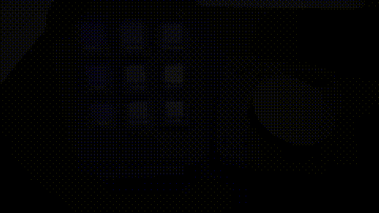
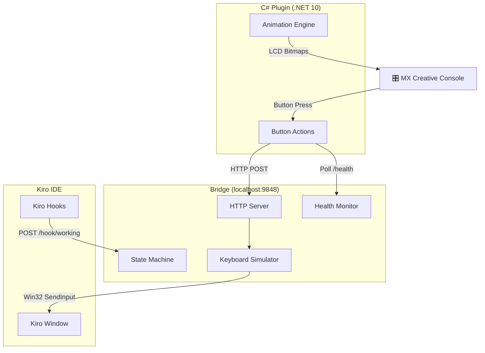

# KiroCan

<p align="center">
  
</p>

## Overview
KiroCan is a physical AI coding companion that connects the Logitech MX Creative Console hardware to Kiro IDE on Windows. Press LCD buttons to send prompts, see animated ghost feedback while Kiro processes requests, and capture screenshots directly into chat.

## Architecture



```
MX Creative Console → C# Plugin (Logi Actions SDK, .NET 10)
                         ↓ extracts + spawns on load
                      Bridge (embedded in DLL as resource → %LOCALAPPDATA%\KiroCan\)
                         ↓ Win32 keyboard simulation via PowerShell
                      Kiro IDE
```

The bridge is compiled into a standalone executable and embedded as a resource inside the plugin DLL. On first load, the plugin extracts it to `%LOCALAPPDATA%\KiroCan\kirocan-bridge.exe` and spawns it automatically. No terminal, no Node.js, no npm required for end users.

### Data Flow

1. **Command flow** (user → IDE): Button press → Plugin → HTTP → Bridge → Win32 keystrokes → Kiro
2. **State flow** (IDE → hardware): Kiro Hook → Bridge state machine → Plugin polls `/health` → Animation updates on LCD
3. **Health flow**: Bridge reads session files → calculates context % → Plugin adjusts ghost sprite variant

## Features
- **Ghost Animation** — 30-frame animated Kiro ghost across 9 LCD buttons while Kiro is working
- **Context Health** — Visual indicator showing context window usage (normal/worried/critical)
- **Screenshot → Chat** — One button to capture screen region and paste into Kiro
- **Screen Record → Chat** — Capture frame sequences for visual analysis
- **Paste To Kiro** — Select text in any app, press button to queue it; auto-pastes when you return to Kiro
- **Stop/Cancel** — Physical button to immediately cancel Kiro generation
- **9 Prompt Commands** — Explain, Criticize, Document, Fix Bug, Optimize, Refactor, Review, Simplify, Write Tests
- **6 Snippet Buttons** — Append qualifiers to chat without sending
- **Utility Controls** — New Session, Inline Chat, Terminal→Chat, Git Commit, Start Spec, Understand Workspace

## Quick Start (End Users)

### Option A: Install from .lplug4 package (recommended)

1. Download the latest `KiroCan.lplug4` from [Releases](https://github.com/memetcircus/Kirocan/releases)
2. Double-click to install — Logi Options+ handles the rest
3. Open Logi Options+ → select MX Creative Console → assign KiroCan buttons
4. Done. The bridge starts automatically when the plugin loads — no terminal needed.

### Option B: Build from source

```bash
git clone https://github.com/memetcircus/Kirocan.git
cd Kirocan
.\scripts\build-release.ps1
```

This compiles the bridge to a standalone exe, embeds it in the C# plugin DLL, and registers the plugin with Logi Plugin Service.

## Prerequisites

### For end users (Option A)
- Windows 10/11
- [Logitech MX Creative Console](https://www.logitech.com/products/keyboards/mx-creative-console.html)
- [Logi Options+](https://www.logitech.com/software/logi-options-plus.html) installed
- [Kiro IDE](https://kiro.dev)

That's it. No Node.js, no .NET SDK, no build tools needed.

### For building from source (Option B)
All of the above, plus:
- [.NET 10 SDK](https://dotnet.microsoft.com/download/dotnet/10.0)
- [Bun](https://bun.sh) (for compiling bridge to standalone exe)

### For development
All of the above, plus:
- [Node.js 22+](https://nodejs.org/) (for running bridge in dev mode with hot reload)

## Setup Instructions

See [SETUP.md](./SETUP.md) for detailed instructions including:
- Logi Options+ button assignment
- Kiro hooks configuration
- Paste To Kiro multi-action button setup
- Troubleshooting common issues

## LCD Button Layout
### Page 1 — Snippets & Controls (animated)
```
┌──────────────┬──────────────┬──────────────┐
│  Screenshot  │  Be Honest   │Don't Code Yet│
├──────────────┼──────────────┼──────────────┤
│ Show Options │  Explain Why │     Stop     │
├──────────────┼──────────────┼──────────────┤
│  Keep Short  │   No Tests   │     Go!      │
└──────────────┴──────────────┴──────────────┘
```

### Page 2 — Utility Controls (no animation)
```
┌──────────────┬──────────────┬──────────────┐
│ New Session  │Struct Prompt │ Inline Chat  │
├──────────────┼──────────────┼──────────────┤
│Terminal→Chat │Screen Record │Paste To Kiro │
├──────────────┼──────────────┼──────────────┤
│  Workspace   │  Start Spec  │  Git Commit  │
└──────────────┴──────────────┴──────────────┘
```

### Page 3 — Prompt Commands (animated)
```
┌──────────────┬──────────────┬──────────────┐
│  Criticize   │   Refactor   │ Write Tests  │
├──────────────┼──────────────┼──────────────┤
│   Explain    │   Fix Bug    │   Optimize   │
├──────────────┼──────────────┼──────────────┤
│    Review    │   Document   │   Simplify   │
└──────────────┴──────────────┴──────────────┘
```

## Ghost Animation — How It Works

The 9 LCD buttons on the MX Creative Console form a unified **360×360px virtual canvas**. Each button displays a **120×120px tile** — when combined, they show a single animated ghost walking across the grid.

### Canvas-to-Button Mapping

```
┌──────────────┬──────────────┬──────────────┐
│   Tile 0     │   Tile 1     │   Tile 2     │  ← Row 0
│  (120×120)   │  (120×120)   │  (120×120)   │
├──────────────┼──────────────┼──────────────┤
│   Tile 3     │   Tile 4     │   Tile 5     │  ← Row 1
│  (120×120)   │  (120×120)   │  (120×120)   │
├──────────────┼──────────────┼──────────────┤
│   Tile 6     │   Tile 7     │   Tile 8     │  ← Row 2
│  (120×120)   │  (120×120)   │  (120×120)   │
└──────────────┴──────────────┴──────────────┘
         = 360×360px unified canvas
```

### Animation Cycle

1. Kiro starts working → Bridge sets state to "working" via hook
2. Plugin polls `/health` every 500ms, detects "working" state
3. AnimationEngine starts: loops through 30 frames at 7fps
4. Each frame: the corresponding tile PNG is loaded from embedded resources
5. All 9 buttons update simultaneously → appears as one large animation
6. Kiro finishes → state becomes "idle" → animation stops, button labels restored

### Walk Pattern (30 frames)

- **Frames 0–14**: Ghost walks left → right (normal orientation)
- **Frames 15–29**: Ghost walks right → left (horizontally mirrored)
- **Vertical bob**: `sin(progress × 2π) × 6px` — gentle floating motion
- **Background**: Solid `#9145fd` purple (matches icon backgrounds for seamless edges)

### Context Health Variants

| Health Level | Context Usage | Sprite Set | Visual |
|---|---|---|---|
| Normal | 0–59% | `ghost-walk/` | Standard ghost |
| Worried | 60–74% | `ghost-walk-worried/` | Worried expression |
| Critical | 75%+ | `ghost-walk-fire/` | Flaming hair |

### Sprite Generation

Run `npm run build:sprites` to regenerate all animation tiles from the source PNGs:

```bash
cd Kirocan
npm install   # installs Jimp (root package.json)
npm run build:sprites   # generates 810 tile PNGs (3 variants × 30 frames × 9 tiles)
```

Source files: `assets/normal.png`, `assets/worried.png`, `assets/onfire.png` (2048×2048 RGBA)
Output: `assets/sprites/tiles/{ghost-walk,ghost-walk-worried,ghost-walk-fire}/frame-XX-tile-Y.png`

## Development

### Bridge Development (hot reload)

For active bridge development, run it directly with Node.js for fast iteration:

```bash
cd bridge
npm install
npm run dev          # build + start once
```

Or with auto-reload on file changes:
```bash
bridge\dev-watch.cmd
```

When running the bridge manually in dev mode, the plugin detects it's already running on port 9848 and skips spawning the embedded exe.

### Plugin Development

```bash
cd KiroCanPlugin\src
dotnet build
```

The build creates a `.link` file so Logi Plugin Service loads the plugin from the build output directory. Changes take effect after Logi Options+ restart.

### Full Release Build

```powershell
.\scripts\build-release.ps1
```

This:
1. Compiles bridge to standalone exe via `bun build --compile`
2. Builds C# plugin (Release configuration)
3. Verifies PluginApi.dll is excluded from output
4. Verifies kirocan-bridge.exe is in output
5. Packages as .lplug4 (if LogiPluginTool is available)

## Testing
### Bridge Tests
```bash
cd bridge
npm test
```
Runs unit tests and property-based tests using Vitest + fast-check.

### Plugin Tests
```bash
cd plugin/tests
dotnet test
```
Runs xUnit tests with FsCheck property-based testing.

## How Kiro Was Used
This project was built entirely within Kiro IDE using its spec-driven development workflow:

1. **Spec Creation** — Requirements, design, and tasks were generated through Kiro's spec workflow (see `.kiro/specs/kirocan/`)
2. **Requirements** — 22 formal requirements in EARS pattern with detailed acceptance criteria
3. **Technical Design** — Full architecture with Mermaid diagrams, component interfaces, and 11 correctness properties
4. **Implementation Tasks** — 18 top-level tasks with 40+ sub-tasks executed sequentially via Kiro
5. **Property-Based Testing** — Correctness properties formalized in the design doc, implemented as fast-check/FsCheck tests
6. **Kiro Hooks** — The project uses Kiro hooks for its own state detection (the product IS a Kiro companion)
7. **Incremental Development** — Every task was committed individually showing the full Kiro-driven development process

## Project Structure
```
KiroCan/
├── .kiro/                      # Kiro specs, hooks, steering
│   ├── specs/kirocan/          # Requirements, design, tasks
│   └── hooks/                  # Working/idle state detection hooks
├── KiroCanPlugin/              # C# Logi plugin (.NET 10)
│   ├── src/
│   │   ├── KiroCanPlugin.cs    # Plugin entry point + bridge extract/spawn lifecycle
│   │   ├── KiroCanApplication.cs  # Bridge polling & state
│   │   ├── PageLayout.cs       # 3-page button layout
│   │   └── Actions/            # Button action handlers
│   └── bin/
│       └── kirocan-bridge.exe  # Compiled bridge (embedded as resource in DLL)
├── bridge/                     # Bridge source (TypeScript)
│   ├── src/
│   │   ├── index.ts            # Entry point (port 9848) + crash protection
│   │   ├── http-server.ts      # Express HTTP endpoints
│   │   ├── state-machine.ts    # Working/idle state + suppression
│   │   ├── health-monitor.ts   # Context health from session files
│   │   ├── clipboard-basket.ts # Paste To Kiro queue + auto-flush
│   │   ├── window-manager.ts   # Window activation (PowerShell)
│   │   ├── keyboard-simulator.ts  # Keystroke simulation (PowerShell)
│   │   └── shortcut-executor.ts   # High-level action orchestrator
│   ├── paste-to-kiro.bat       # Helper for Logi Multi-action setup
│   ├── dev-watch.cmd           # Auto rebuild + restart for development
│   └── package.json
├── scripts/
│   └── build-release.ps1       # Full release build script
├── assets/                     # Ghost sprite source + generated tiles
├── README.md
├── SETUP.md                    # Detailed setup guide
└── LICENSE
```

## Third-Party Libraries

### Bridge (TypeScript → compiled to standalone exe)
| Library | Version | Purpose | License |
|---------|---------|---------|---------|
| express | 4.21.2 | HTTP server | MIT |
| vitest | 3.1.3 | Test runner (dev only) | MIT |
| fast-check | 3.23.2 | Property-based testing (dev only) | MIT |
| supertest | 7.1.0 | HTTP testing (dev only) | MIT |
| typescript | 5.8.3 | TypeScript compiler (dev only) | Apache-2.0 |

### Plugin (C#)
| Library | Purpose | License |
|---------|---------|---------|
| PluginApi.dll | Logi Actions SDK | Logitech proprietary |
| xUnit | Test framework | Apache-2.0 |
| FsCheck.Xunit | Property-based testing | BSD-3-Clause |

### Build Tools
| Tool | Purpose | License |
|------|---------|---------|
| Bun | Compiles bridge to standalone exe | MIT |

## API Costs & Rate Limits
- **No API costs** — all communication is local (HTTP on localhost:9848)
- **No rate limits** — the bridge processes requests sequentially
- **No external services** — fully offline, no internet required

## License
MIT License. See [LICENSE](./LICENSE) for details.
